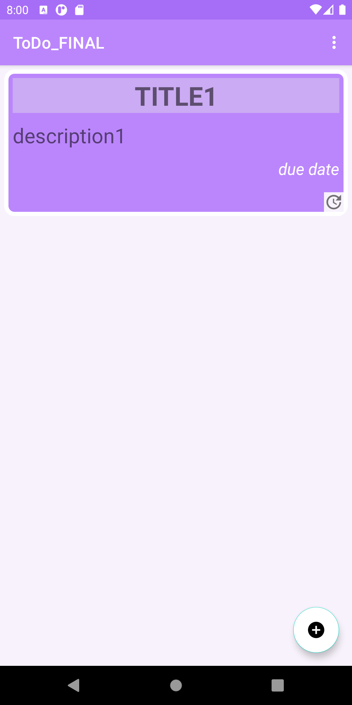
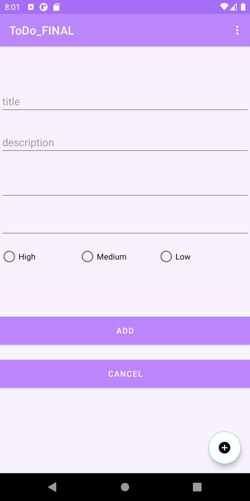
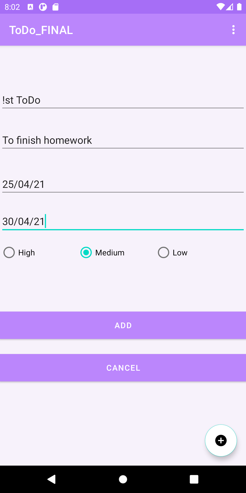
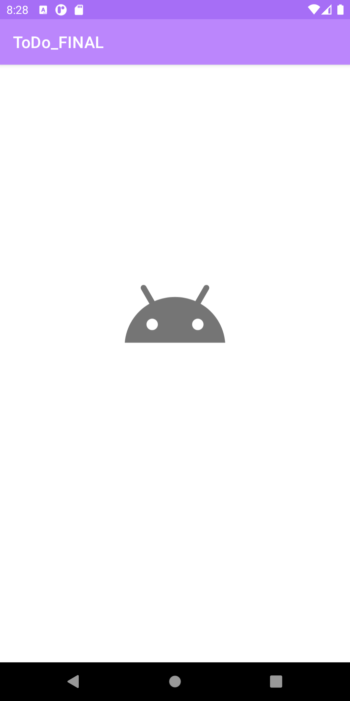
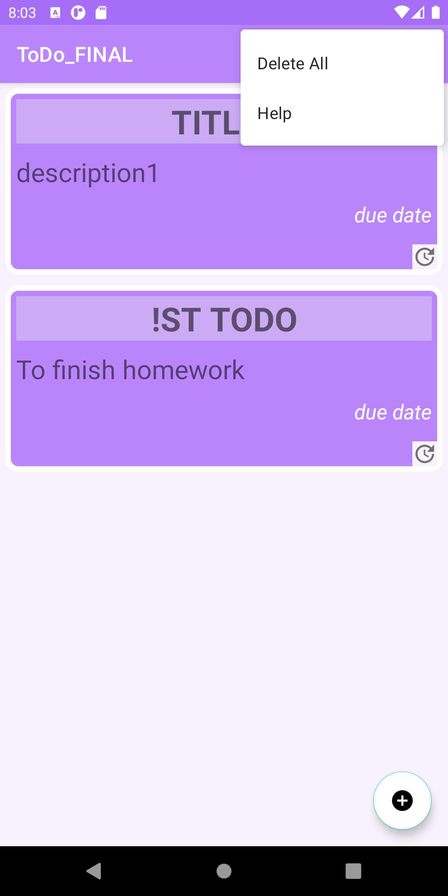
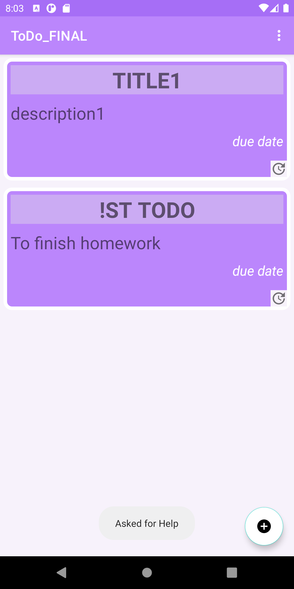
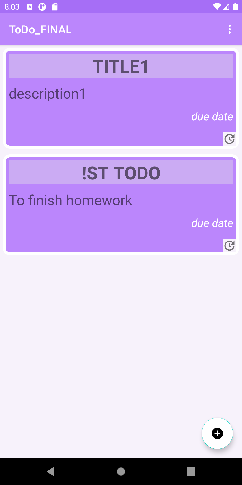
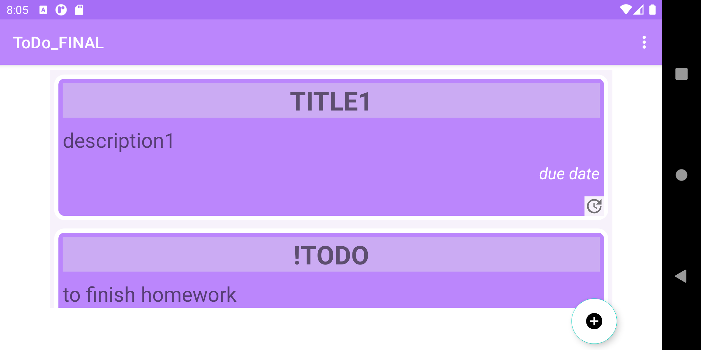
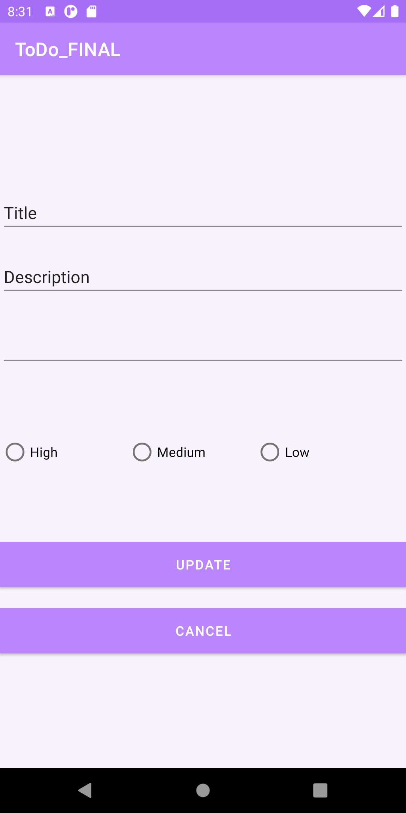
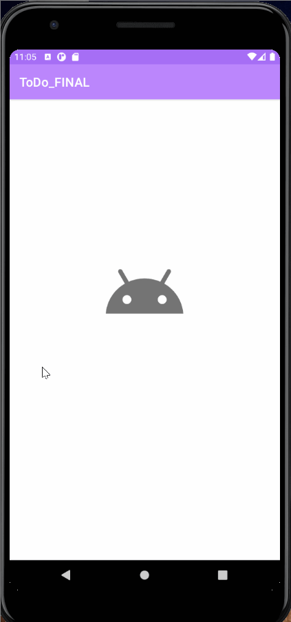

# ToDoFinal

       TODO APP ASSIGNMENT

       Main Page

       Insert task

       Inserted Task

       Splash Activity   

       Menu

       Help Toast

        Main page after Insert

        Main Page Landscape

        Update Task

        Todo GIF

References:
<ul>
    <li>     https://github.com/binay-shah/todo_sec_a.git
    <li>     StackOverFlow</li>
    <li>     Youtube</li>
    <li>    TutorialPoint</li>
    <li>     Android Developer</li>
       <li>     ebbi</li>
       </ul>
